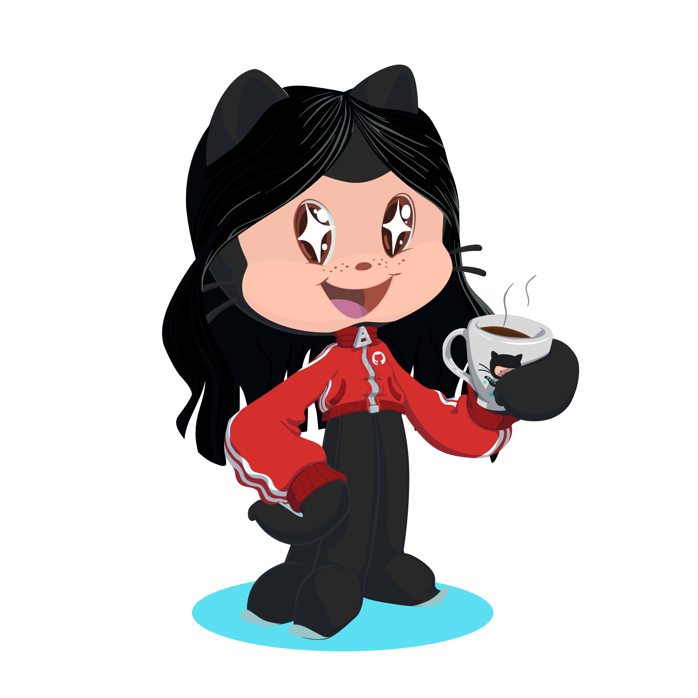

  
  <b>`B O A S  V I N D A S !`</b>
   
  
Olá! Eu sou a <b>Mariana Rafaela</b>, desenvolvedora em início de carreira explorando o <b>ecossistema Python</b> com foco em <b>Inteligência Artificial</b>. Também desenvolvi um conhecimento estruturado em Front-End por meio de pequenos projetos.

  

 

  
  

 
  
  
  
  
  
  
  

 
 
 

  
  
“In real open source, you have the right to control your own destiny”   Linus Torvalds

